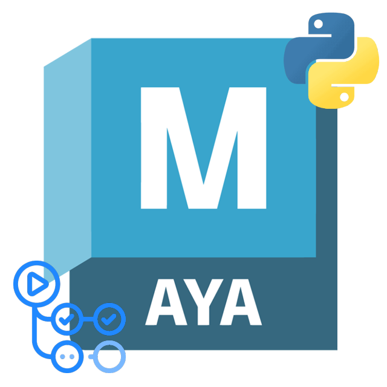

<a id="readme-top"></a>

<div align="center">


<!-- PROJECT LOGO -->
<br />
  <a href="https://github.com/matthewlee-dev/maya-python-project-template">
    
  </a>

[](https://github.com/matthewlee-dev/maya-python-project-template/actions/workflows/template-ci.yml)
[](https://github.com/astral-sh/uv)
[](https://github.com/astral-sh/ruff)
[![Python][python_3-shield]][python-url]
[![Maya][maya-shield]][maya-url]
[![GitHub Actions][github-actions-shield]][github-actions-url]

<h3 align="center">Maya Python Project Template</h3>

  <p align="center">
    A GitHub template for Maya Python tools<br>
    <a href="https://github.com/matthewlee-dev/maya-python-project-template/issues/new?labels=bug&template=bug-report---.md">Report Bug</a>
    ·
    <a href="https://github.com/matthewlee-dev/maya-python-project-template/issues/new?labels=enhancement&template=feature-request---.md">Request Feature</a>
  </p>
</div>

## Why this template exists
Maya Python projects often start as a small collection of scripts and grow into production tools without the development infrastructure growing with them.

This template provides a modern, reproducible foundation for that infrastructure from the outset, so a tool can go from initial development to reliable distribution. The goal isn't to prescribe how a Maya tool should be written, just to remove the repetitive setup work around it.

## How to use this template

### Do not fork. Use the [Use this template][use-template-link] button instead.

1. Click [Use this template][use-template-link].
2. Name the new project (lowercase, hyphen-separated, e.g. `my-awesome-project`) and add a description.
3. GitHub Actions processes the template and commits to the new repo. Check progress in the Actions tab.
4. Wait for the first CI run to finish, then clone and start coding.

### CLI / agent quickstart

No browser needed:

```sh
gh repo create my-cool-tool --template matthewlee-dev/maya-python-project-template --public
```

Wait for the `initial repository setup` workflow to finish before cloning. See [AGENTS.md](AGENTS.md) for the full non-interactive flow.

## What is included in this template?
* Basic project structure.
* Dependency and packaging management with [uv](https://docs.astral.sh/uv/), configured via `pyproject.toml`.
* [README.md](_new_project/README.md) and [CONTRIBUTING.md](_new_project/CONTRIBUTING.md) templates.
* Bug report and feature request templates.
* Continuous integration using [GitHub Actions][github-actions-url] with jobs to:
  * [Run integration tests](.github/workflows/reusable-maya-tests.yml) across a range of Maya versions in isolated Docker containers. 
    * `Note: You should hold a valid Maya license.`
  * [Enforce coding standards](.github/workflows/reusable-static-analysis.yml) with [ruff](https://github.com/astral-sh/ruff).
  * [Build and deploy documentation](.github/workflows/reusable-build-and-deploy-docs.yml) to GitHub pages with [mkdocs](https://www.mkdocs.org/).
  * [Manually triggered releases](.github/workflows/ci-release.yml): pick a version number and it tags, releases, and deploys docs (optional). The release also builds an installable Maya module zip (`.mod` + `<name>_drag_and_drop_installer.py`) and attaches it to the GitHub Release.

<!-- ACKNOWLEDGMENTS -->
## Acknowledgments
* This project uses Docker images courtesy of [mottosso/docker-maya](https://github.com/mottosso/docker-maya).
* Inspiration taken from both:
  * [python-project-template](https://github.com/rochacbruno/python-project-template/tree/main).
  * [Best-README-Template](https://github.com/othneildrew/Best-README-Template).


<!-- MARKDOWN LINKS & IMAGES -->
<!-- https://www.markdownguide.org/basic-syntax/#reference-style-links -->

<!-- Python -->
[python_3-shield]: https://img.shields.io/badge/Python-3.X-grey?logo=python&logoColor=ffdd54&labelColor=%233670A0
[python-url]: https://python.org/
[github-actions-shield]: https://img.shields.io/badge/GitHub%20Actions-%232671E5?logo=githubactions&logoColor=white
[github-actions-url]: https://github.com/features/actions

<!-- Maya -->
[maya-shield]: https://img.shields.io/badge/Autodesk-Maya-%2337A5CC?logo=autodeskmaya&logoColor=%2337A5CC
[maya-url]: https://www.autodesk.com/nz/products/maya/overview

<!-- template links -->
[use-template-link]: https://github.com/matthewlee-dev/maya-python-project-template/generate
