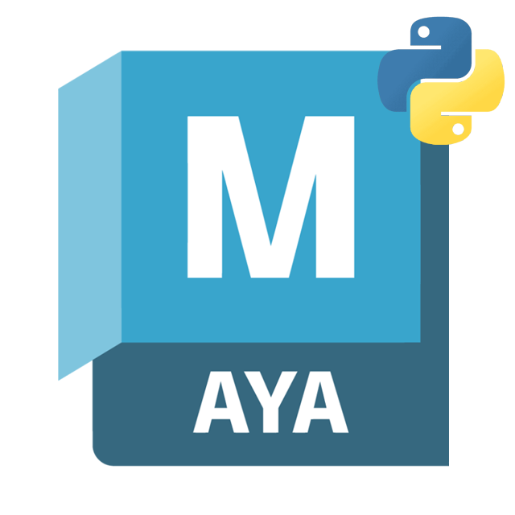

<a id="readme-top"></a>

<!-- PROJECT SHIELDS -->
<div align="center">

[](https://github.com/{{PROJECT_OWNER}}/{{PROJECT_NAME}}/actions/workflows/ci-main.yml)
[![pytest][pytest-shield]][pytest-url]
[](https://github.com/astral-sh/uv)
[](https://github.com/astral-sh/ruff)


<!-- PROJECT LOGO -->
<br />
  <a href="https://github.com/{{PROJECT_OWNER}}/{{PROJECT_NAME}}">
    
  </a>

[![Python][python_3-shield]][python-url]
[![Maya][maya-2024-2027-shield]][maya-2027-url]
[![Maya][maya-cmds-shield]][maya-cmds-url]

<h3 align="center">{{PROJECT_TITLE}}</h3>
  {{PROJECT_DESC}}
  <br />
  <p align="center">
    <a href="https://{{PROJECT_OWNER}}.github.io/{{PROJECT_NAME}}"><strong>Explore the docs »</strong></a>
    <br />
    <br />
    <a href="https://github.com/{{PROJECT_OWNER}}/{{PROJECT_NAME}}">View Demo</a>
    ·
    <a href="https://github.com/{{PROJECT_OWNER}}/{{PROJECT_NAME}}/issues/new?labels=bug&template=bug-report---.md">Report Bug</a>
    ·
    <a href="https://github.com/{{PROJECT_OWNER}}/{{PROJECT_NAME}}/issues/new?labels=enhancement&template=feature-request---.md">Request Feature</a>
  </p>
</div>


<!-- TABLE OF CONTENTS -->
<details>
  <summary>Table of Contents</summary>
  <ol>
    <li>
      <a href="#about-the-project">About The Project</a>
    </li>
    <li>
      <a href="#getting-started">Getting Started</a>
      <ul>
        <li><a href="#prerequisites">Prerequisites</a></li>
        <li><a href="#installation">Installation</a></li>
        <li><a href="#usage">Usage</a></li>
      </ul>
    </li>
    <li><a href="#roadmap">Roadmap</a></li>
    <li><a href="#contributing">Contributing</a></li>
    <li><a href="#license">License</a></li>
    <li><a href="#contact">Contact</a></li>
    <li><a href="#acknowledgments">Acknowledgments</a></li>
  </ol>
</details>


<!-- ABOUT THE PROJECT -->
## About The Project

Please replace this text with a description of the project.

<div align="center">

[![Product Name Screen Shot][product-screenshot]][project-link]

</div>
    
<p align="right">(<a href="#readme-top">back to top</a>)</p>


<!-- GETTING STARTED -->
## Getting Started
Please replace this text with a guide to getting started with this project.

Development and contribution guidelines can be found on the [contributing](CONTRIBUTING.md) page.


<p align="right">(<a href="#readme-top">back to top</a>)</p>


### Prerequisites
Please replace this text with a list of pre-requisites for the project.

* Maya

<p align="right">(<a href="#readme-top">back to top</a>)</p>


### Installation

1. Clone the repo, or download and extract the zip from the [project page][project-link].
    ```sh
    git clone https://github.com/{{PROJECT_OWNER}}/{{PROJECT_NAME}}.git  
    ```
2. Installation instructions go here.


<p align="right">(<a href="#readme-top">back to top</a>)</p>


<!-- USAGE EXAMPLES -->
### Usage

Use this space to show useful examples of how the project can be used.

_For more examples, please refer to the [Documentation](https://{{PROJECT_OWNER}}.github.io/{{PROJECT_NAME}})._

<p align="right">(<a href="#readme-top">back to top</a>)</p>


<!-- ROADMAP -->
## Roadmap
- [ ] Feature: foo
  - [ ] Feature: bar
  - [ ] Feature: baz

See the [open issues](https://github.com/{{PROJECT_OWNER}}/{{PROJECT_NAME}}/issues) for a full list of proposed features (and known issues).

<p align="right">(<a href="#readme-top">back to top</a>)</p>


## Contributing
If you have a suggestion that would make this better, please open an issue from the [request a feature](https://github.com/{{PROJECT_OWNER}}/{{PROJECT_NAME}}/issues/new?labels=enhancement&template=feature-request---.md) or [report a bug](https://github.com/{{PROJECT_OWNER}}/{{PROJECT_NAME}}/issues/new?labels=bug&template=bug-report---.md) pages.

Development and contribution guidelines can be found on the [CONTRIBUTING.md](CONTRIBUTING.md) page

<!-- LICENSE -->
## License

Distributed under the `insert_license_name` license. See `LICENSE` file for more information.

<p align="right">(<a href="#readme-top">back to top</a>)</p>


<!-- CONTACT -->
## Contact

Please reach out via the [request a feature](https://github.com/{{PROJECT_OWNER}}/{{PROJECT_NAME}}/issues/new?labels=enhancement&template=feature-request---.md) or [report a bug](https://github.com/{{PROJECT_OWNER}}/{{PROJECT_NAME}}/issues/new?labels=bug&template=bug-report---.md) pages.

<p align="right">(<a href="#readme-top">back to top</a>)</p>


<!-- ACKNOWLEDGMENTS -->
## Acknowledgments
* Project template by [matthewlee-dev](https://deform.dev).

<p align="right">(<a href="#readme-top">back to top</a>)</p>


<!-- MARKDOWN LINKS & IMAGES -->
<!-- https://www.markdownguide.org/basic-syntax/#reference-style-links -->

<!-- EDIT-ME: add product screenshot -->
[product-screenshot]: docs/resources/images/screenshot.png
[project-link]: https://github.com/{{PROJECT_OWNER}}/{{PROJECT_NAME}}


<!-- Python -->
[python_3-shield]: https://img.shields.io/badge/Python-3.X-grey?logo=python&logoColor=ffdd54&labelColor=%233670A0
[python-url]: https://python.org/
[pytest-shield]: https://img.shields.io/badge/tests-pytest-%230A9EDC
[pytest-url]: https://docs.pytest.org/

<!-- Maya: swap the header badges for the variants your tool targets -->
[maya-2024-shield]: https://img.shields.io/badge/Maya-2024-%2337A5CC?logo=autodeskmaya&logoColor=%2337A5CC
[maya-2024-url]: https://help.autodesk.com/view/MAYAUL/2024/ENU/
[maya-2025-shield]: https://img.shields.io/badge/Maya-2025-%2337A5CC?logo=autodeskmaya&logoColor=%2337A5CC
[maya-2025-url]: https://help.autodesk.com/view/MAYAUL/2025/ENU/
[maya-2026-shield]: https://img.shields.io/badge/Maya-2026-%2337A5CC?logo=autodeskmaya&logoColor=%2337A5CC
[maya-2026-url]: https://help.autodesk.com/view/MAYAUL/2026/ENU/
[maya-2027-shield]: https://img.shields.io/badge/Maya-2027-%2337A5CC?logo=autodeskmaya&logoColor=%2337A5CC
[maya-2027-url]: https://help.autodesk.com/view/MAYAUL/2027/ENU/
[maya-2024-2027-shield]: https://img.shields.io/badge/Maya-2024_--_2027-%2337A5CC?logo=autodeskmaya&logoColor=%2337A5CC
[maya-cmds-shield]: https://img.shields.io/badge/Maya-cmds-%2337A5CC?logo=autodeskmaya
[maya-cmds-url]: https://help.autodesk.com/cloudhelp/2027/ENU/Maya-Tech-Docs/CommandsPython/
[maya-openmaya-shield]: https://img.shields.io/badge/Maya-OpenMaya-%2337A5CC?logo=autodeskmaya
[maya-openmaya-url]: https://help.autodesk.com/view/MAYADEV/2027/ENU/?guid=Maya_DEVHELP_Maya_Python_API_Maya_Python_API_1_0_Using_the_Maya_Python_API_html
[maya-api-openmaya-shield]: https://img.shields.io/badge/Maya-api.OpenMaya-%2337A5CC?logo=autodeskmaya
[maya-api-openmaya-url]: https://help.autodesk.com/cloudhelp/2027/ENU/MAYA-API-REF/py_ref/
[maya-url]: https://www.autodesk.com/nz/products/maya/overview
